# Informe Desafío 1  (fases 1 y 2 )

------

 **Consigna:**  Aunar en un sólo documento las diferentes experiencias y enfoques de cada integrante del grupo respecto del Objetivo General.

 **Objetivo:**  Analizar de manera estática y dinámica un malware activo y real del tipo ramsonware en un ambiente seguro.  

 **Ambiente:**  Una instalación de una máquina virtual tipo Windows 7 / Windows Server 2008 (no más modernas para permitir el despliegue del malware a estudiar)
            Se asegurará este ambiente virtual antes del inicio del análisis dando de baja su conexión de red desde el sistema operativo y desde el entorno VirtualBox.
            Se deshabilitaran además, desde éste último, toda forma de comunicación de la VM con el host anulando las opciones de copy/paste y carpeta compartida.
            
 **Software:**  Para la infección de utilizará un ramsomware conocido y ampliamente difundido por lo que su comportamiento se ya se conoce:   *Jiwsow*  
             

**Introducción:**  Habiendo seguido las indicaciones del documento provisto como: *Requisitos Previos de FASE 1 - Introducción al Análisis Dinámico y Estático de Malware con Systernals en Windows.*
se habrá infectado el sistema con *Jigsaw* 
                

​            Para poder seguir con mayor precisión el comportamiento de este ramsomware se utilizaran imagenes o documentos agregados a tal fin.
​            Se recuerda que este tipo de malware encripta archivos de tipo documento generados por programas de uso masivo (archivos de tipo office, videos, imágenes y algunos tipos específicos
ej. archivos de Autocad) con el fin de exigir un rescate en bitcoins por la desencriptación de los mismos, además de amenazar con el borrado aleatorio de archivos del file system.
​            Tiene así mismo la capacidad programada de camuflarse con nombres de programas conocidos para permanecer en ejecución así como la apertura subrepticia de puertos para comunicarse con sus explotadores, también bajo nombres de programas conocidos. 

​                

####  **FASE 1:**      

 **Identificación del malware utilizando el *Proccess Explorer***

​            El primer detalle que puede establecer un indicio de que un programa no es auténtico sino un proceso maligno camuflado es a primera vista la ausencia de una firma. Si bien existen procesos legítimos que pueden no poseerla.
​            
​            **-Caso:** *Firefox.exe*
​            Dando click sobre el nombre sospechoso del programa en el despliegue de sus propiedades en la solapa *Srings* se pueden hallar justamente las cadenas de texto que puede
​desplegar el malware en consola. En este caso se puede ver el mensaje en texto plano.

  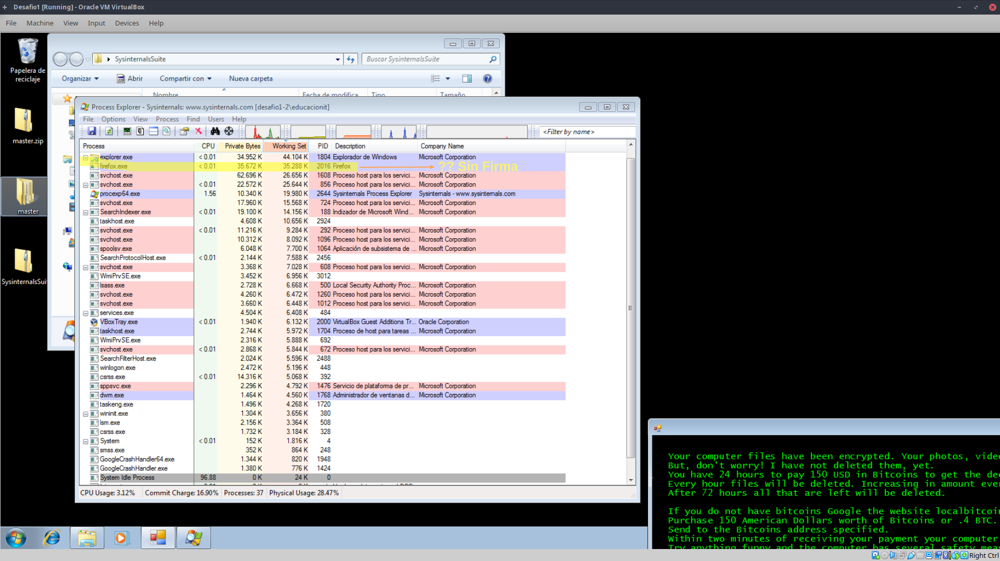          
  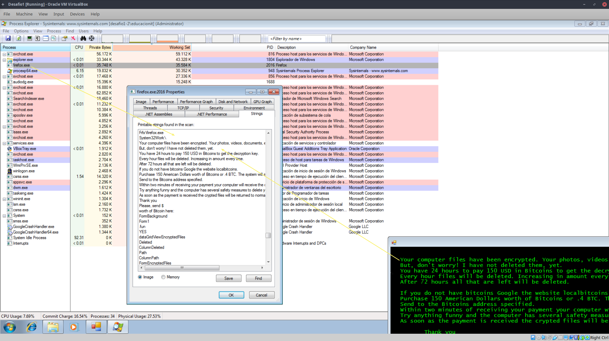         

 **-Caso:**  *Google Crash Handler (.exe y 64.exe)*
            No teniendo en el sistema operativo de la VM instalado ningún software de Google llama la atención la presencia de dos ejecutables que en primera instancia muestran su firma correctamente.
            No encontrando en strings ninguna referencia que pueda a prioi establecer su uso en complicidad con el malware se investiga en la web y aparece como un programa legítimo
            para el envío de datos tipo informes de fallos de pogramas provistos por Google. Se presume entonces que se utiliza por el malware como vía de comunicación hacia el           atacante.
            En la solapa Image se constata los procesos de seguridad establecidos para esta versión de sistema operativo referentes a la utilización de los espacios de memoria por parte de los procesos en jecución ( en este caso sólo DEP y ASLR) 

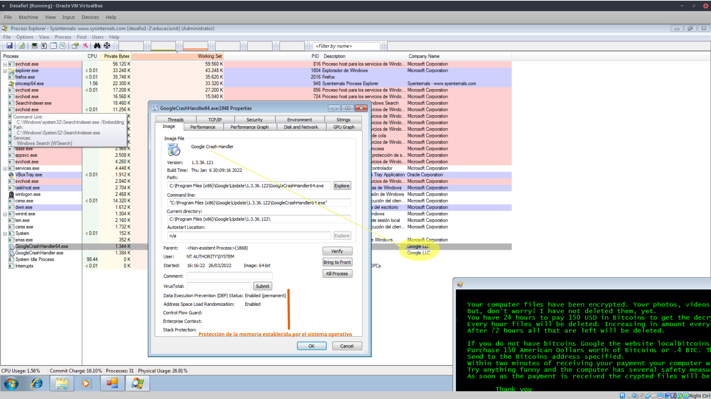

  

​            

**Utilización de la herramienta *Autoruns***
           

​        Como primer indicio al abrir el Autoruns es el encontar una determinada entrada en la vista de un proceso que se muestra resaltado con un color que destaca del resto indicando algo de tono sospechoso.
​        
​        Dando click en propiedades se pueden acceder a detalles más específicos de este proceso sospechoso bajo el nombre de un programa conocido (*Firefox, Dropbox*, etc) 

- En primera instancia aparece el nombre original del archivo que confirma que se trata de parte del malware que ha infectado al sistema.        

   - Esta vista muestra en una de sus solapas el detalle de las firmas digitales y al observar los detalles de la/s misma/s no se puede/n comprobar el origen de la entidad certificante.

        

        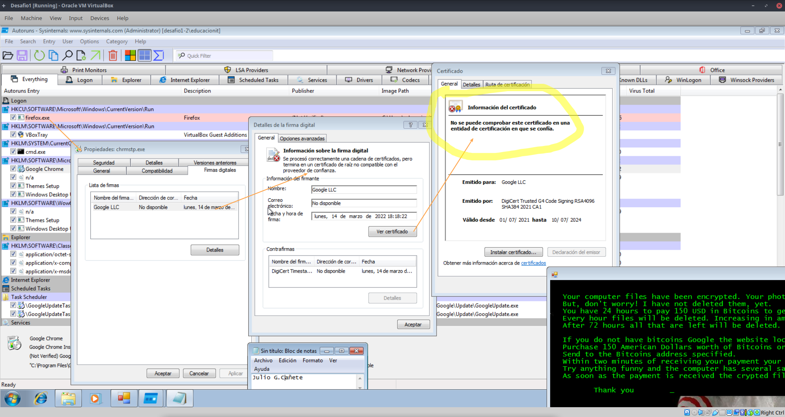

        

   - Al dar click para editar el registro del sistema se observa que ha colocado valores en la misma que aseguran su integración con el sistema operativo de manera de ejecutarse  cada vez que se inicie el mismo (persistencia)   

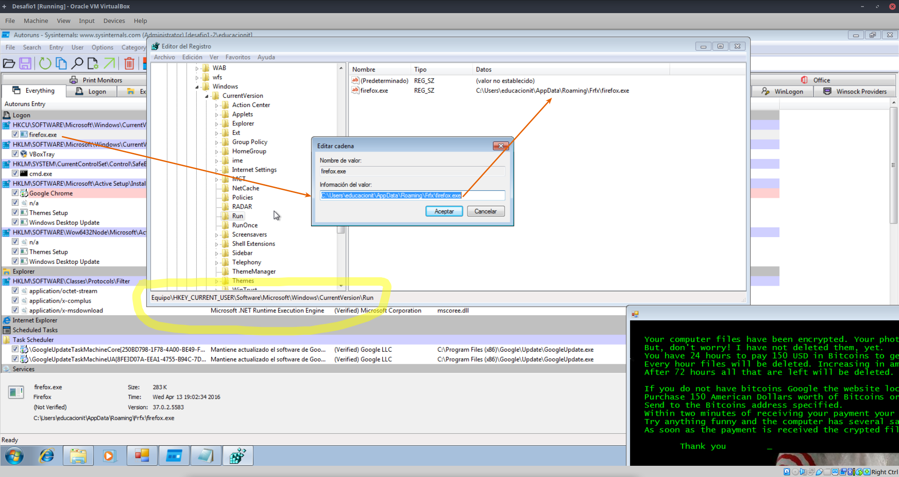

###### Verificación del daño infligindo:

​              El archivo *C:\Windows\System32\drivers\rdvgkmd.sysy*  ,en general parte de la instalación original del sistema operativo, se reporta como no encontrado.

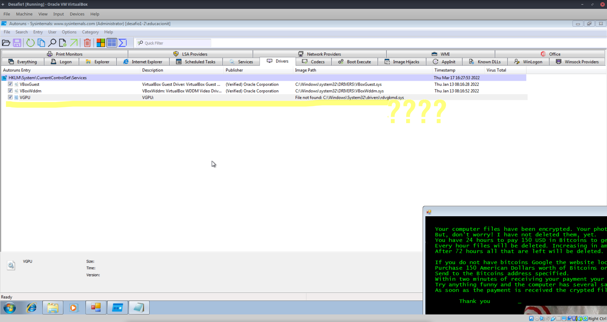

​              

​              La carpeta Documentos muestra los archivos de extensión conocida como ya encriptados con el subfijo ***.fun***  Noteste el caso del archivo .drawio que no ha sido afectado siendo este un documento gráfico de formato no común en el mercado.

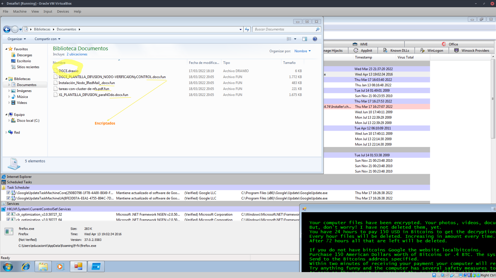

#### **FASE 2**          

 **Analisis del malware en memoria** 

​              **Utilización de la Herramienta RAM Map**   
​            
​              Esta herramienta muestra exactamente como Windows asigna la memoria física, así como cuánta memoria esta en caché o cuánta memoria es utilizada por el kernel o drivers.
​              La vista general de la herramienta hace una abstraccón colorida de los parámetros generales de la memoria.

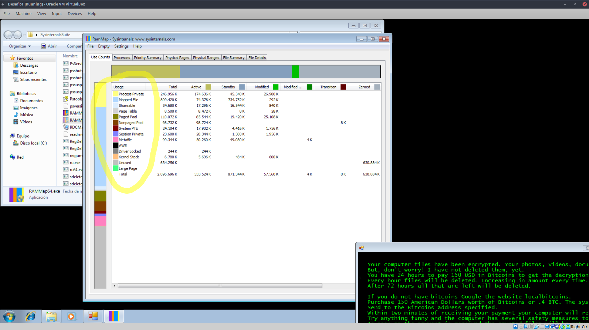

​                 La solapa de que muestra el sumario de uso se observa al programa ya catalogado como instalado por el ramsonware para comunicarse con la fuente a  la cabeza de la cantidad  total mensurada.

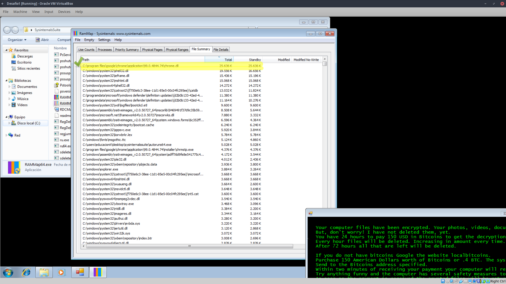

​     **Utilización de la herramienta VMMap**
​                   En esta herramienta al seleccionar en este caso el proceso identificado con nombre falso Firefox.exe se puede observar gráficamente como se despliega en la virtual ram y el consumo  o estado por tipo definido (Heap, Image, Managed Heap, etc) 

​                 A su vez se puede desplegar en su parte inferior ordenando por tipo y ubicar este proceso dentro del área manejada por el ASLR que si bien no impide la ejecución del malware no permite que este tome y utilice, por ejemplo,un rango exclusivo del sistema operativo. 

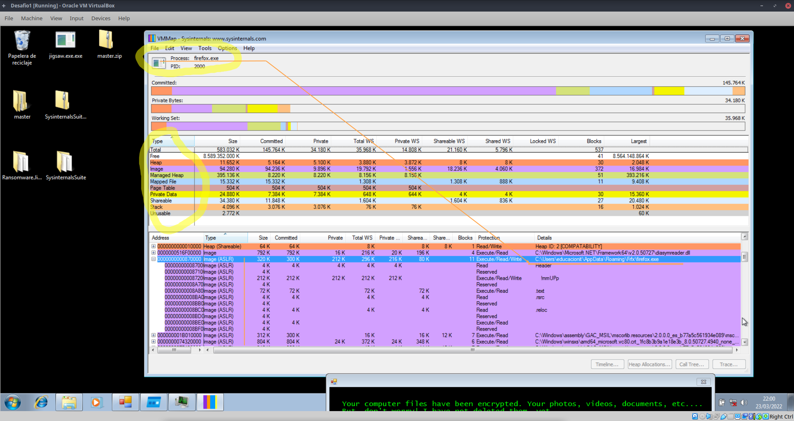

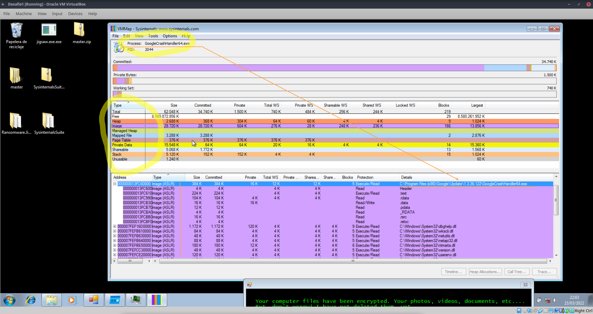

​                

#### Fase 3                

​              **Utilización de la Herramienta online any.run**         

Se analizará dinámicamente el proceso de infección por parte de un malware.

 **Ambiente:**  https://any.run  una página  web que provee una instalación de una máquina Windows 7 de 32 bits totalmente funcional contenida en sistema de tipo sandbox (ambiente de prueba 100% funcional pero totalmente aislado) , además de ofrecer la posibilidad de realizar un análisis de malware en formato interactivo en tiempo real. Uno de los aspectos muy positivos que ofrece el uso de ésta herramienta es la utilización que esta hace de MITREMITRE ATT&CK® , una base de conocimientos globalmente accesible de tácticas y técnicas de uso en malwares.

 

 **Software:**  Para la infección se utilizará un ramsomware conocido y ampliamente difundido por lo que su comportamiento se ya se conoce y el la misma vesión que el el análisis realizado en la VM:  *Jiwsow*  

 

**Requisitos de uso:** Registrarse con una casilla de mail válida y password para la versión básica (la que se utilizó) , existe una versión de pago con muchas funcionalidades extendidas con la posibilidad, por ejemplo, de utilizar otro sistema operativo o versión de 64 bits

  

**Ajustes Previos:** En primer lugar, se debe configurar una nueva tarea en la que elija el archivo o la URL que desea analizar, seleccionando el sistema operativo (por default Windows 7 versión de 32 bits) para el entorno, las opciones de conectividad que desea usar (la red está inhabilitada por defecto)  y el software que debe precargarse y cuánto tiempo durará la sesión interactiva.

​                               Una vez configurado el ambiente se puede interactuar con el escritorio, hacer clikcs en los botones, abrir el menú de inicio, utilizar navegadores instalados y ejecutar aplicaciones de similar a una VM o máquina físca. 

​                              En este caso se optó por subir el malware ya provisto y activarlo de la misma forma que en la VM

​                              La diferencia es que en esta sandbox se registrará todas las solicitudes de red, las llamadas de proceso, la actividad del archivo y la actividad del registro como se muestra en las imagenes a continuación.

**Malware activado en la vista general del panel presentado**     

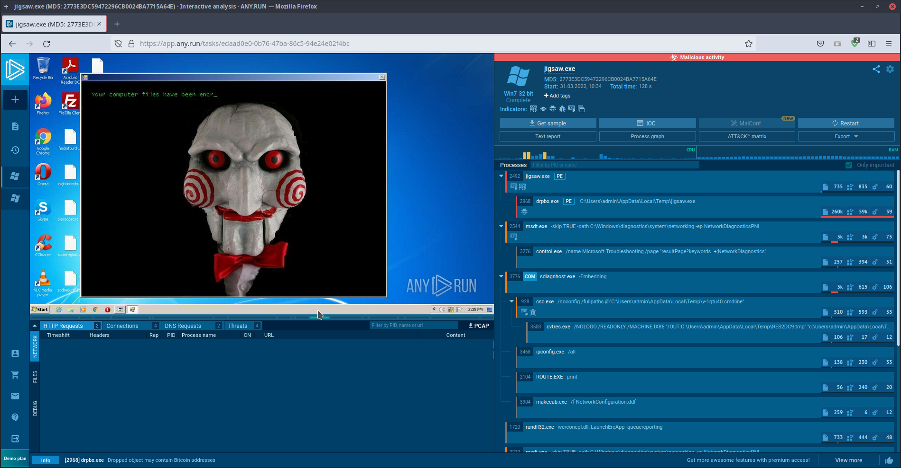

​                          

​                           En el panel de la derecha se podrá constatar la actividad desplegada por el malware en tanto se ejecuta en el sistema bajo el título de Processes, todo en tiempo real:

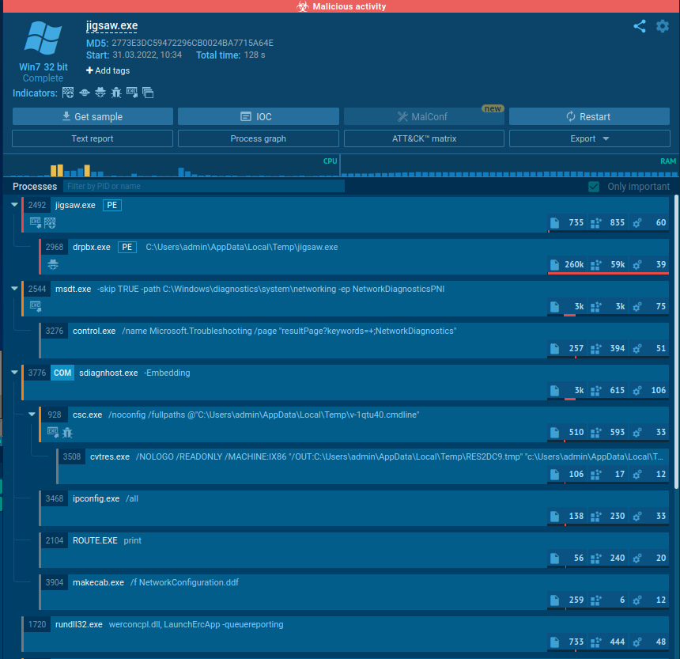             

​                              Además se puede hacer click en un proceso iniciado y ver qué archivos fueron modificados,  qué cambios a nivel registro se realizaron, etc.

​                             En el ejemplo se muestra la información extendida del proceso corriendo bajo el nombre dropbox.exe iniciado por el malware.

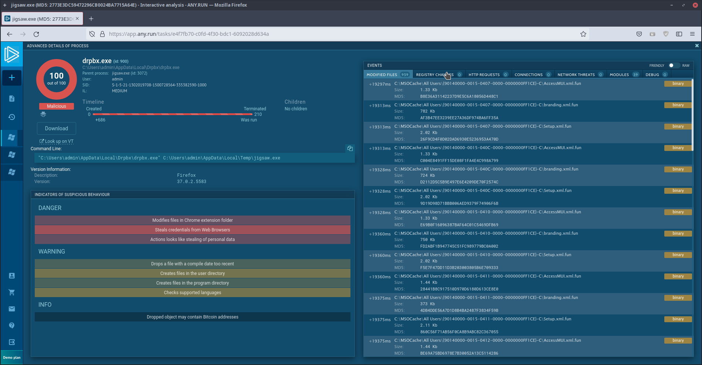

​                    

​                           A continuación una vista extendida del malware mismo por su nombre real y no por nombre falso con el que se muestra, nombre que adopta de forma pre programada de acuerdo al sistema en que se despliega.

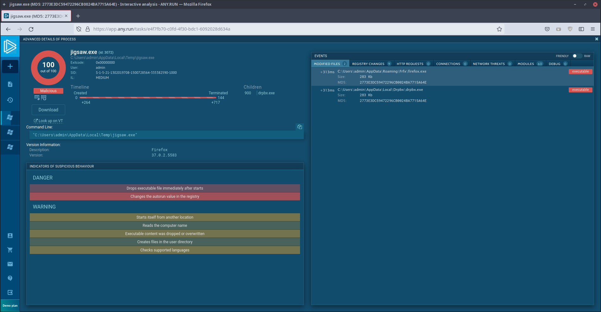

​                           Otra de las ventajas del analizador incluído es la generación de reportes de fácil lectura y comprensión

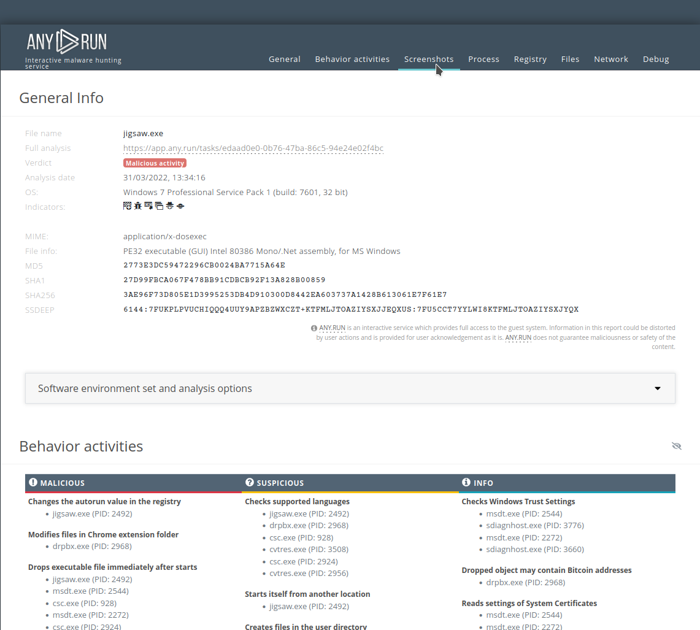

**Detalles:** 

-  **Análisis de Comportamiento**

  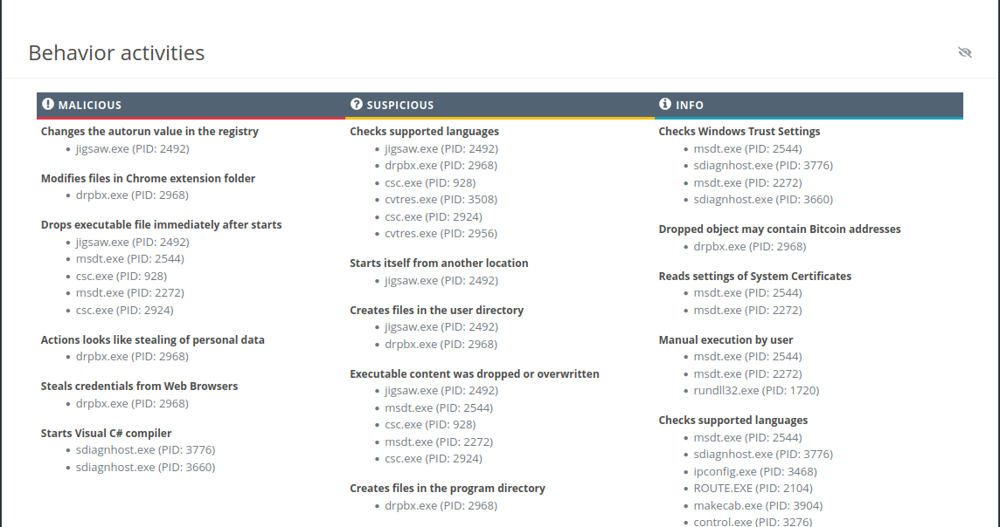

-  **Gráfico** (que relaciona en forma visual los distintos pasos realizados por el malware en su infección del sistema)

  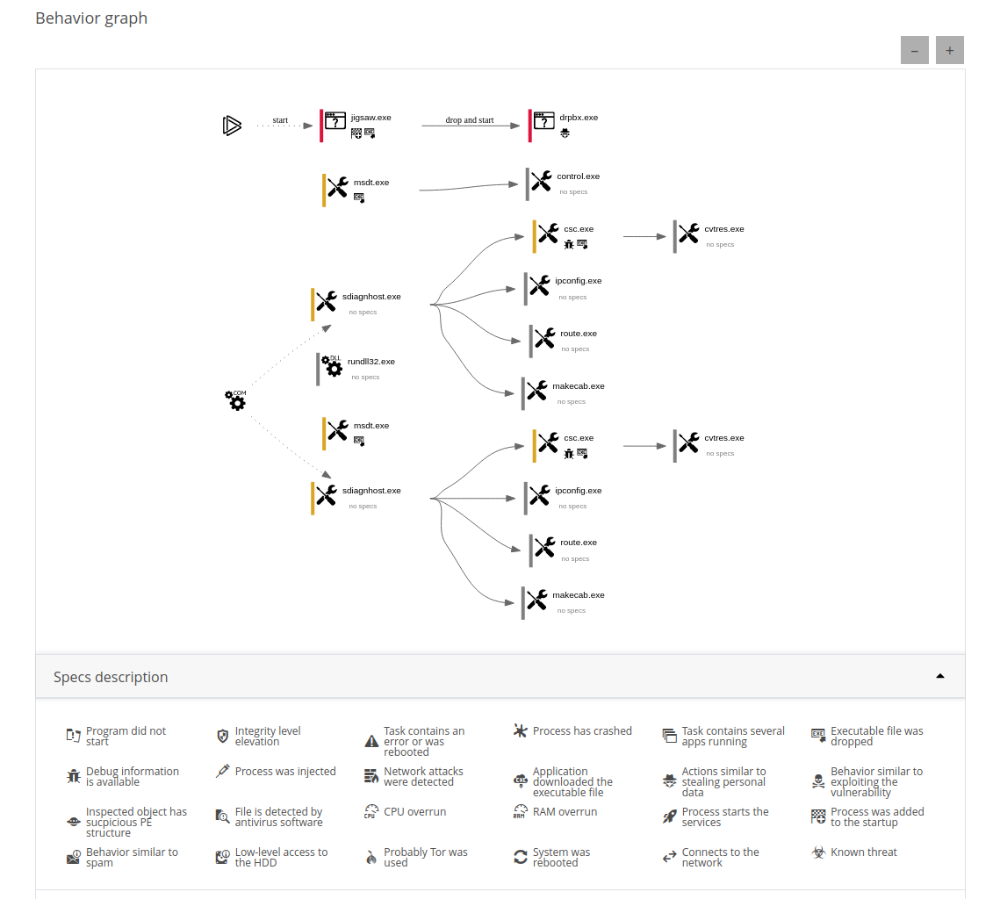

  

- **Actividad en los archivos (tabla)**

  

 

**Actividad de Red**

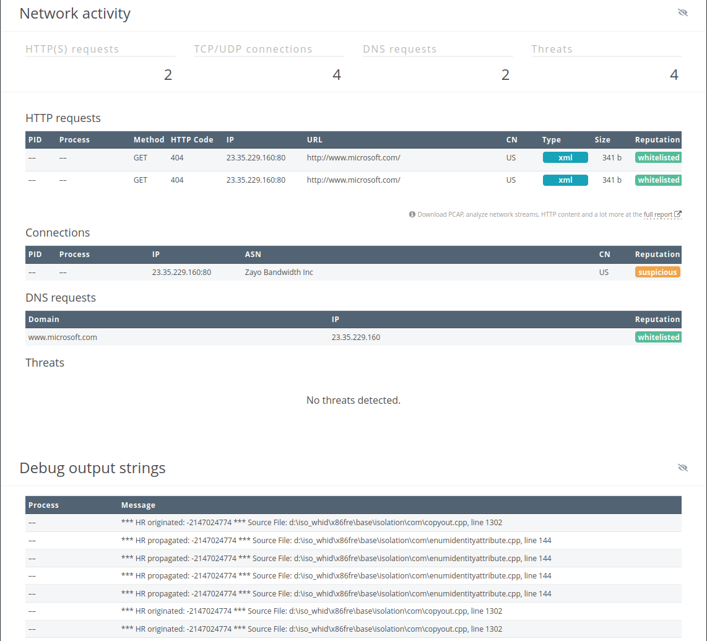

###### **Conclusiones:**   

Aún con las limitaciones del uso gratis, el despliegue en tiempo real del comportamiento del software malicioso o potencialmente malicioso sumada a la colección de datos obtenidas es muy completa y permite de un modo ameno y bien presentado revisar cómo ha sido afectado el sistema operativo y los datos de usuario que pudiera albergar.
